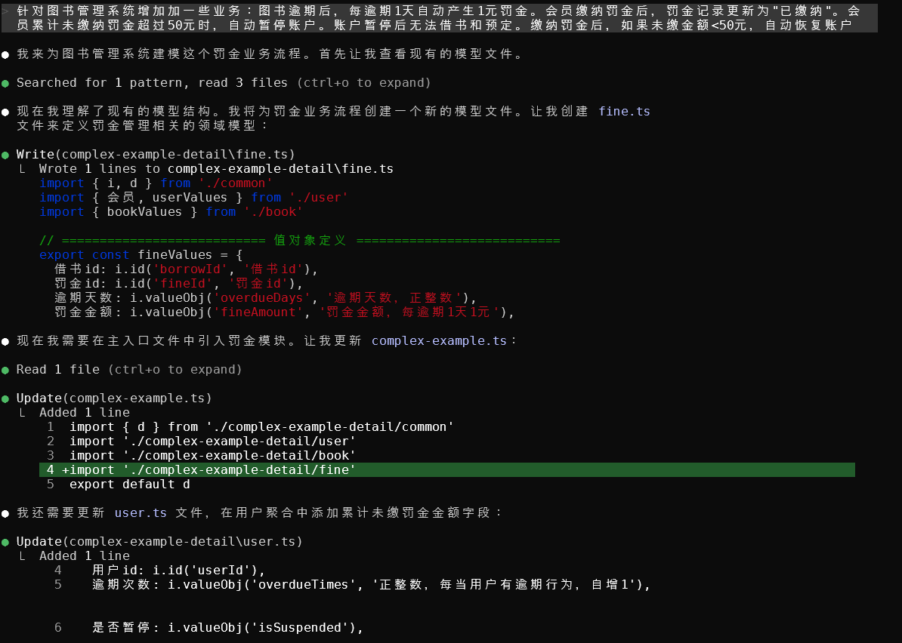

---
# https://vitepress.dev/reference/default-theme-home-page
layout: home

hero:
  name: 'Domain Designer'
  text: 'DDD Modeling Productivity Tool'
  tagline: 'Domain design through TypeScript code'
  actions:
    - theme: brand
      text: Get Started
      link: /en-US/guide/introduction/getting-started
    - theme: alt
      text: GitHub Repository
      link: https://github.com/ddd-tool/domain-designer-cli-node

features:
  - title: Domain-Driven Design
    details: All UML node concepts are derived from Domain-Driven Design
  - title: Event Storming + Workflows + User Stories
    details: Analyze business from multiple perspectives, guide users to shift focus, and easily discover design flaws
  - title: Maintain with Your Project
    details: No special handling required. Like ordinary code, version control through Git, SVN, etc. Suitable for team collaboration
  - title: TypeScript Programming Language
    details: No need to learn a DSL that's useless in other scenarios. Leverage TS compilation to reduce design errors. For projects with high business complexity, you can even achieve "strongly-typed requirement analysis"
  - title: Easy to Learn and Use
    details: Functional style, no classes, no "type gymnastics". Ensures JavaScript-level difficulty for both frontend and backend developers
  - title: Ready to Use
    details: All user-required features integrated into a single CLI tool
  - title: Visual Display
    details: Display your current design on the web with a single command. Accommodate non-technical stakeholders during requirements discussions
  - title: Export SVG
    details: Conveniently reference designs in documents like Office files
---

::: info What You Write Is What You Get

:::

::: info AI Friendly

:::
